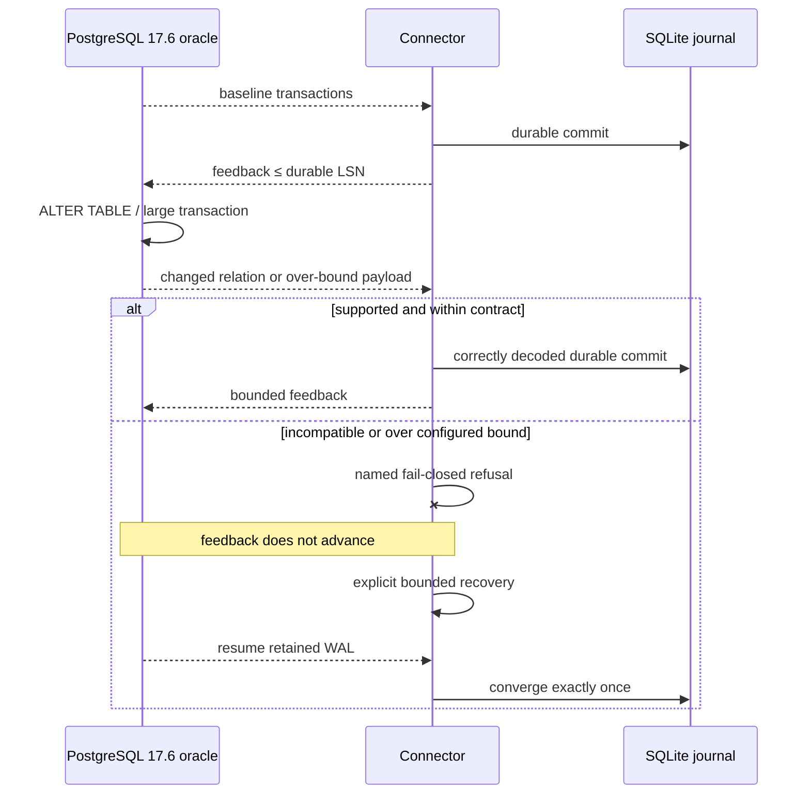

# [Boring CDC Durable Stream Simple Case] Hardening plan, visually

## Structure

```text
scripts/acceptance/
├── durable_simple_case.sh          # retained crash/restart baseline
├── durable_schema_change.sh        # nullable evolution + incompatible DDL
└── durable_volume_bounds.sh        # configured-bound refusal + recovery
src/
├── m1_decoder.rs                   # relation metadata invalidation/revalidation
├── m2_capture_runtime.rs           # safe stop, feedback, and recovery wiring
├── m2_spool.rs                     # memory/disk/transaction admission
└── m2_journal.rs                   # durable transaction boundary
```

## Behavior



## Planned delta

```diff
 durable stream proof
   kill -9 + downtime writes + restart
   PostgreSQL oracle set equality
+  nullable-column change while streaming
+  incompatible DDL: named fail-closed boundary
+  large rows cross configured spool/journal bound
+  bounded RSS/refusal and explicit recovery
+  post-recovery PostgreSQL oracle set equality

 evidence and CI
-  six-transaction simple case only
+  fast schema guard considered for per-push CI
+  volume scenario kept standalone unless measured runtime is sane
+  one terminal reseal after both slices
```
