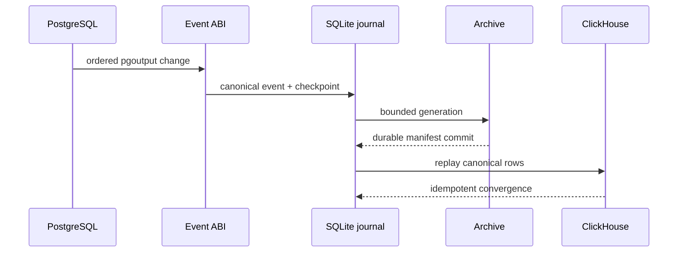

# Boring CDC M0 Contracts — what changed

Reviewed implementation: `54ddb4e482ff42d9817343466a3f5e850ae77532`

Expected target head before this presentation-only commit: `38d89a79d4c56bc7e2f7581de695f550a0f59c35`

Target: `epic/boring-cdc-m0`

## Shipped shape

```diff
 repository/
+├── contracts/{event,postgres,storage,archive,clickhouse}/
+├── fixtures/m0/                    # deterministic positive/failure vectors
+├── scripts/validate/               # six fail-closed M0 validators
+├── scripts/lib/m0_scaffold.py      # executable-bound, redacted evidence
+└── artifacts/*/evidence.json       # digest-bound proof receipts

 M1 runtime lane
+├── protocol, workload, bootstrap, config and CLI contracts
+├── quality CI scanning without static credential-shaped fixtures
+└── completion guard rejecting M0-PROVISIONAL across product/root surfaces
```

## Final review fixes

```diff
 scaffold evidence
- binary_sha256 derived from Cargo.lock
+ binary_sha256 hashes the tested executable
+ cargo_lock_sha256 separately and honestly identifies Cargo.lock

 retained transcripts
- possible absolute workspace/temp/secret-file paths
+ normalized and redacted before retention
+ validator rejects path leakage and containment escapes

 quality fixtures
- static credential/token-shaped literals tripped the broad secret scanner
+ runtime-identical escaped/concatenated fixture values
+ scanner remains broad, unchanged, and fail-closed
```

## Shipped flow



## Proof boundary

- Locked format, Clippy, check, build, and all-target Rust tests: pass.
- Six M0 contract validators and 67 Python tests: pass.
- M1 completion verify/probe and security exposure validation: pass.
- Exact-SHA sandbox at `54ddb4e482ff42d9817343466a3f5e850ae77532`: pass.
- Fresh adversarial review: approve, no material findings.
- Duplicate Bead IDs: 0; product/contract `M0-PROVISIONAL` markers: 0.
