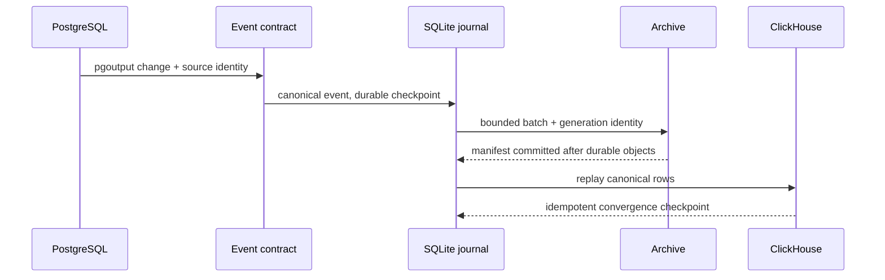

# Boring CDC M0 Contracts — what changed

Reviewed implementation: `d54d1683c57d97e1382d9ce7af367b05f21f0300`

Target: `epic/boring-cdc-m0`

## Contract surface

```diff
 repository/
+├── scaffold/                 # Rust binary, Compose, CI, config, agent hooks
+├── contracts/
+│   ├── event/                # canonical event ABI + JSON Schema
+│   ├── postgres/             # capture/backfill and least-privilege grants
+│   ├── storage/              # SQLite schema + disk/WAL budget model
+│   ├── archive/              # Parquet/Zstd generation + commit manifests
+│   └── clickhouse/           # DDL, canonical query, generation retirement
+├── fixtures/m0/              # deterministic positive and failure vectors
+├── scripts/validate/         # executable contract validators
+└── artifacts/*/evidence.json # digest-bound proof receipts
```

## Shipped flow



## Contract gates

```diff
 M0 input
-  prose-only expectations
+  machine-readable schema + deterministic fixtures
+  validator emits digest-bound evidence
+  exact-SHA sandbox proof
+  adversarial fresh review

 Owner literals
-  M0-PROVISIONAL annotations
+  cards 5a994cfd and 765bd3b2 accepted
+  recommended values reconciled
+  zero provisional markers
```

## Review focus

1. Inspect `contracts/m0/manifest.json` for the six registered artifacts.
2. Read `docs/EVENT_FORMAT.md` and `docs/CLICKHOUSE_MODEL.md` for the public contract shape.
3. Run the validators listed in the plan; aggregate local and exact-SHA sandbox proof passed at the reviewed implementation SHA.
