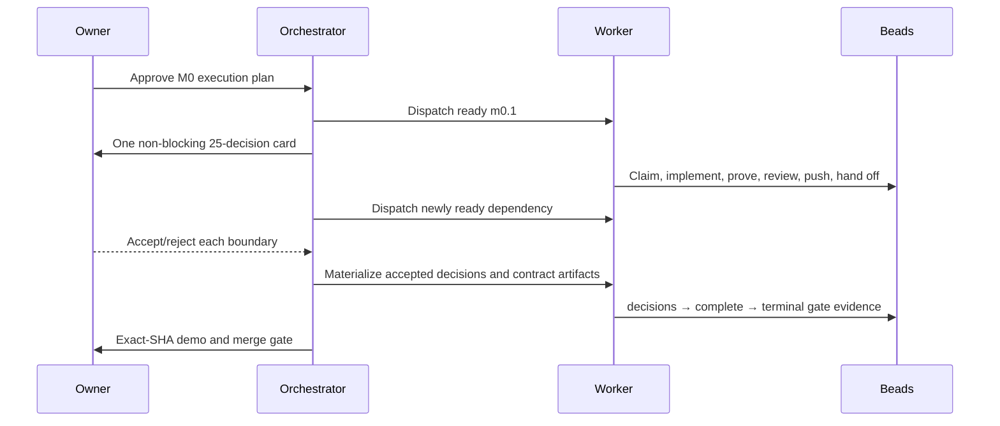

# Boring CDC M0 — plan, visually

## What M0 adds

```diff
 boring-cdc/
+├── contracts/                 # approved exact M0 schemas, registries, and models
+├── scripts/agent/             # read-only context tools, then lifecycle integration
+├── scripts/validate/          # deterministic contract/evidence/graph validators
+├── scripts/acceptance/        # non-bypassable M0 completion and terminal gate
+├── artifacts/boring-cdc-m0*/ # content-bound milestone evidence
 ├── docs/PLAN.md               # canonical architecture and decision register
 └── .beads/issues.jsonl        # Git-pinned existing execution graph
```

## How execution advances



## Non-bypassable dependency shape

```text
m0.1
├── m0.2 ───────────────┬── 25 decision Beads ── m0-decisions ─┐
└── m0.3 ─┐             │                                      │
           └─ validation-tooling ── contract/scaffold owners ──┼─ m0-complete
                                                              └─ m0-gate
                                                                   └─ M1 may begin
```

The existing graph is reused unchanged: the kickoff overrides generic `epic:` relabeling/materialization rules, so execution follows the repository's `m0` label and dependency edges.
