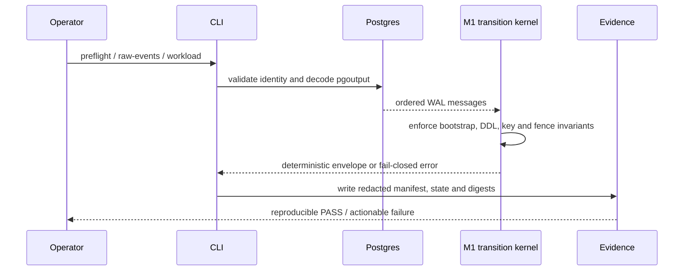

# Boring CDC M1 — what changed

Reviewed implementation: `f54b07123a874f346c063c3b105532c957e0634c`  
Epic-closure metadata: `9cd3127`

## Runtime shape

```diff
 src/
+├── m1_config.rs              # typed TOML, fingerprints, limits
+├── m1_decoder.rs             # fail-closed pgoutput/CopyBoth decoding
+├── m1_source_identity.rs     # source identity and capture epochs
+├── m1_ordering.rs            # canonical ordering and conflict rules
+├── m1_bootstrap_sm.rs        # bootstrap transition state machine
+├── m1_preflight.rs           # read-only safety checks
+├── m1_workload.rs            # deterministic workload and oracle
+└── m1_raw_demo.rs            # raw-event demonstration and fault surface
```

## Proof shape

```diff
 repository
+├── contracts/m1/             # executable case inventories and schemas
+├── fixtures/m1/              # pinned Compose workload inputs
+├── scripts/{e2e,faults}/     # repeated runtime and failure probes
+├── artifacts/boring-cdc-m1-* # manifests, logs, states, and SHA-256 sets
+└── scripts/acceptance/m1_complete.sh
```

## Shipped flow



## Completion evidence

- All 11 required M1 leaves are closed.
- The blocking graph is acyclic and the raw demo remains downstream.
- Completion probe ran twice with identical stdout digest `ef5ff0d64695579ca8d050f5e98e03c8c73d3005155be242425e3e8630c40a26`.
- Evidence digest: `12e3beebda8a7d47039b19738aba2d5251653a69b442b4f3e85dace2bf967f63`.
- Owner cards `5a994cfd-e4e2-46a7-b512-5dae280acae0` and `765bd3b2-4b68-4102-a9ec-43ca93357390` were reconciled; matching provisional markers were confirmed or corrected.
