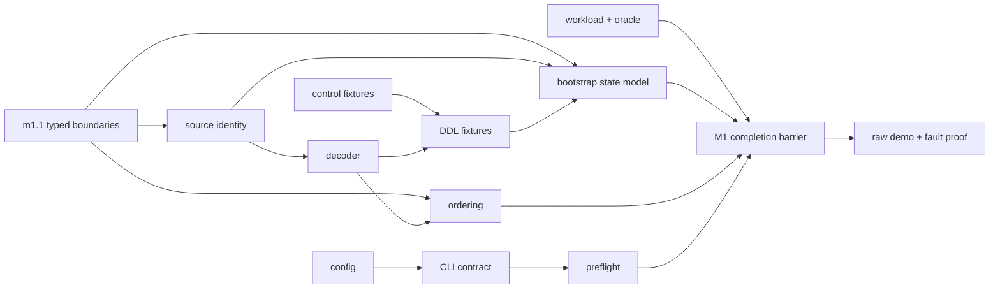

# Boring CDC M1 plan, visually

## Structure — what M1 adds

```text
boring-cdc (one Rust binary)
├── boundary kernel + deterministic harness
├── config + shared CLI envelopes
├── PostgreSQL protocol
│   ├── source/capture-epoch identity
│   ├── CopyBoth pgoutput decoder
│   ├── publication/control fixtures
│   └── relation/DDL guard fixtures
├── bootstrap state-machine fixtures
├── read-only preflight
├── deterministic workload + exact oracle
└── raw-event demo + milestone fault proof
```

## Behavior — dependency-shaped delivery



`boring-cdc-m0-gate` remains in the graph but is owner-waived only for M1 scheduling; all other blockers remain enforced.

## Diff-shaped outcome

```diff
 current stacked baseline
+ typed non-interchangeable protocol positions and deterministic transition harness
+ stable CLI/config contracts and read-only preflight
+ fail-closed pgoutput, control, ordering, and DDL fixtures
+ bootstrap lifecycle model with creation floor distinct from durable progress
+ deterministic source workload and independent exact correctness oracle
+ exact-SHA raw-event demo and milestone evidence
- no auxiliary slots, online table add, destination runtime, or M0 graph changes
```
