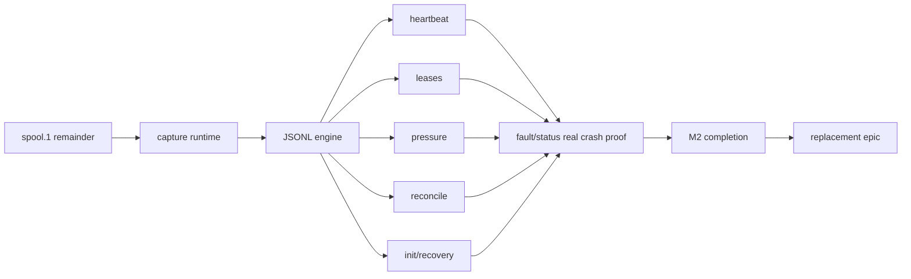

# [Boring CDC M2 Durable Journal] Plan, visually

## Structure

```text
src/
├── article1_capture.rs       # retained pg_walstream receive path
├── m2_spool.rs              # capped unfinished remainder first
├── m2_journal.rs            # retained durable transaction commit
├── m2_ownership.rs          # retained exclusive ownership/fencing
├── m2_capture_runtime.rs     # integrate receive → durable commit → feedback
├── m2_jsonl.rs              # deterministic directory commit engine
└── m2_{heartbeat,leases,pressure,reconcile,init_recovery}.rs
scripts/{e2e,faults,validate}/ # PostgreSQL 17.6 real-crash proof
```

## Dependency flow



## Durable-before-feedback change

```diff
 PostgreSQL CopyBoth frame
   decode transaction
+  admit through bounded spool
+  atomically commit events + end LSN to SQLite
+  verify durable source position
   send standby-status feedback
+  replay after abrupt process death
+  commit deterministic JSONL directory before checkpoint promotion
```
