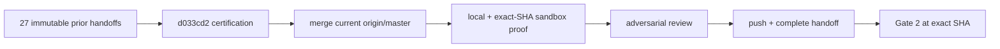

# [Boring CDC M2 Durable Journal] Plan, visually

## Existing implementation retained

```text
src/
├── article1_capture.rs       # consumed pg_walstream receive path
├── m2_{schema,journal,ownership,spool}.rs
├── m2_capture_runtime.rs     # decode → spool → durable commit → feedback
├── m2_jsonl.rs               # deterministic archive commit
├── m2_{heartbeat,leases,pressure,reconcile,init_recovery}.rs
└── m2_fault_status.rs        # status + real crash hooks/evidence
```

## Relaunch-v4 flow



## Delta from the already-built branch

```diff
 retained M2 implementation and PostgreSQL 17.6 crash evidence
 retained content-addressed handoff certification
+merge af4c285a2/current approved M0 base
+resolve integration fallout and accepted M0 literals only
+regenerate invalidated certification/evidence at exact SHA
+open/update PR to epic/boring-cdc-m0 and freeze green head
```
