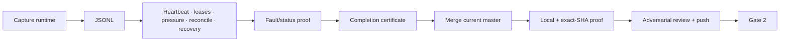

# [Boring CDC M2 Durable Journal] Plan, visually

## Structure retained

```text
src/
├── article1_capture.rs       # shared pg_walstream receive path
├── m2_{schema,journal,ownership,spool}.rs
├── m2_capture_runtime.rs     # decode → spool → durable commit → feedback
├── m2_jsonl.rs               # deterministic archive commit
├── m2_{heartbeat,leases,pressure,reconcile,init_recovery}.rs
└── m2_fault_status.rs        # status + real crash hooks/evidence
```

## Dependency and execution flow



## Relaunch delta

```diff
 retained M2 implementation and PostgreSQL 17.6 crash evidence
 retained immutable handoffs and certification at d033cd2
+v6 Bead graph records every named slice without reclaiming work
+merge current origin/master af4c285a2
+materialize accepted M0 literals and remove matching provisional markers
+recertify affected evidence at the exact pushed SHA
```
