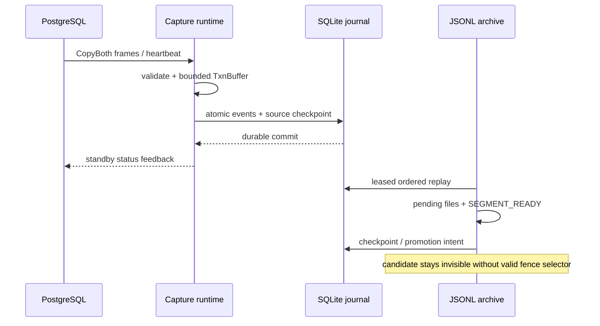

# [Boring CDC M2] Plan, visually

## Structure

```text
src/
├── m2_schema + ownership       # SQLite contracts, migrations, exclusive owner
├── m2_failure + journal        # persisted retry policy, durable capture commit
├── m2_spool + reconciliation   # bounded admission, restart integrity
├── m2_pressure + leases        # retention/reserves, generation fencing
├── m2_capture_runtime          # CopyBoth → journal → feedback
└── m2_jsonl                    # directory commit + SEGMENT_READY
scripts/{e2e,faults,validate}/   # exact-SHA component/milestone proof
contracts/coverage/             # one canonical Bead per obligation
```

## Behavior



## Change shape

```diff
 current M1 protocol/fixture foundation
+SQLite M2 schema, intents, leases, checkpoints
+shared persisted FailurePolicy and scheduler
+bounded capture spool and durable journal writer
+startup reconciliation, retention, disk-pressure control
+integrated CopyBoth capture-to-feedback runtime
+deterministic JSONL directory commit engine
+crash hooks, status JSON, exact-SHA milestone proof
```

## Graph admission issue visible at Gate 1

```text
requested first dispatch: m2.1
existing dependency:      m2-schema → m2.1
factory label required:   epic:boring-cdc-m2
existing labels:          m2 (m2.1: kickoff-plan,policy)
owner rule:               do not relabel or edit graph
```
